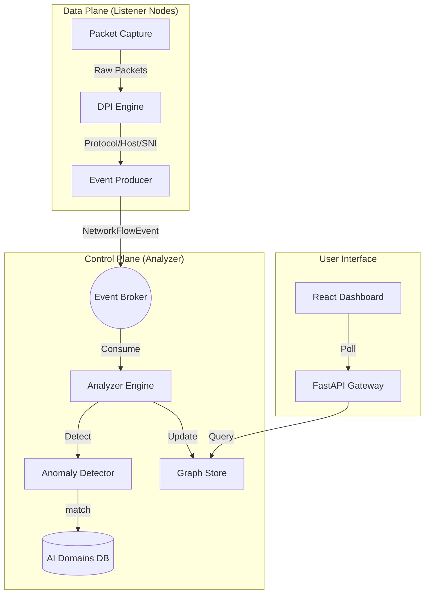

# Architecture Overview

Shadow Hunter operates as a hybridized **Control Plane / Data Plane** architecture, adhering to zero-trust principles.

## Core System Layers

- **Data Plane (The "Sensors"):**
  - **Listener Service:** Distributed, lightweight agents deployed as DaemonSets (K8s) or Sidecars.
  - **DPI Engine:** Powered by Scapy (Python) or eBPF (C/Rust), utilizing `libpcap`/`Npcap` for packet capture.
  - **Capabilities:** Full L7 extraction (HTTP Host, TLS SNI, DNS Queries) to identify services by name, not just IP.

- **Control Plane (The "Brain"):**
  - **Analyzer Service:** Centralized processing engine.
  - **Event Broker:** Decoupled messaging bus (`Kafka` for Enterprise, `Memory` for Local).
  - **Graph Store:** Persistent topology DB (`Neo4j` for Enterprise, `NetworkX` for Local).

- **Presentation Layer:**
  - **API:** REST API (FastAPI) serving the graph and alerts.
  - **Dashboard:** Real-time React application for visualization.

## Diagram

## Data Flow

1.  **Ingestion:** Listeners capture traffic, parse L7 headers, and publish verified events.
2.  **Enrichment:** Analyzer checks destination against Threat Intel and AI Domain databases.
3.  **Graph Building:** Nodes (Services/IPs) and Edges (Flows) are upserted into the Graph Store.
4.  **Analysis:** Heuristic and ML models scan for forbidden flows or anomalies.
5.  **Visualization:** Users explore the live dependency graph in the Dashboard.
